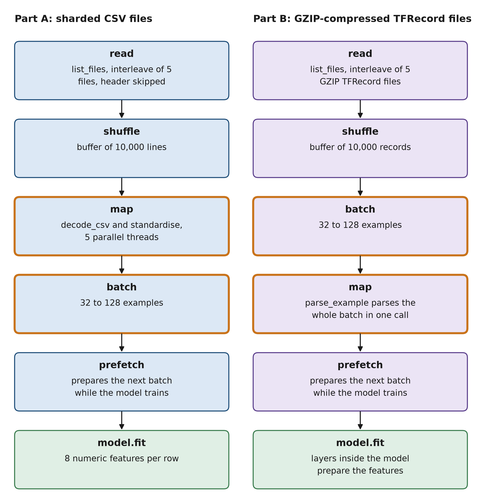
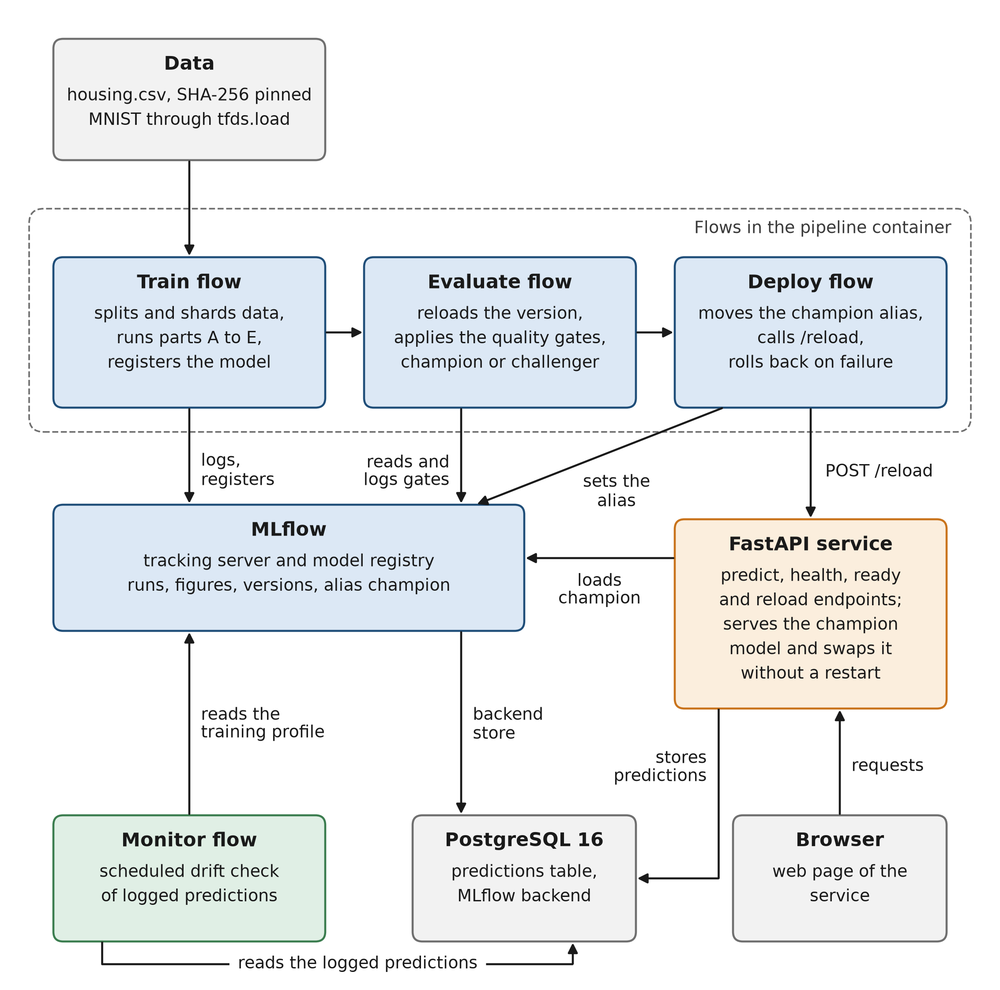
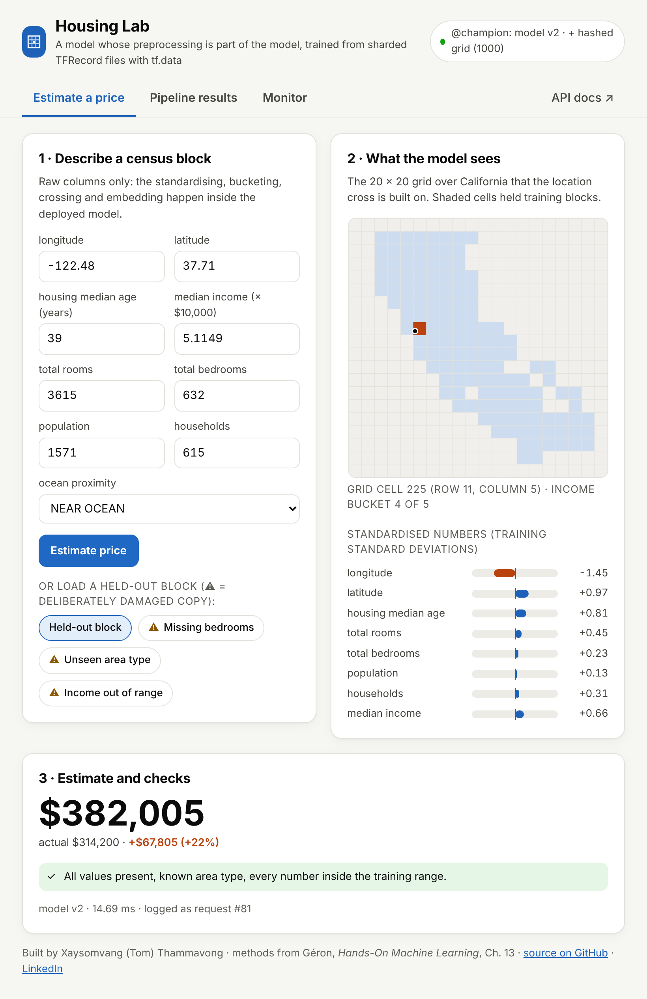
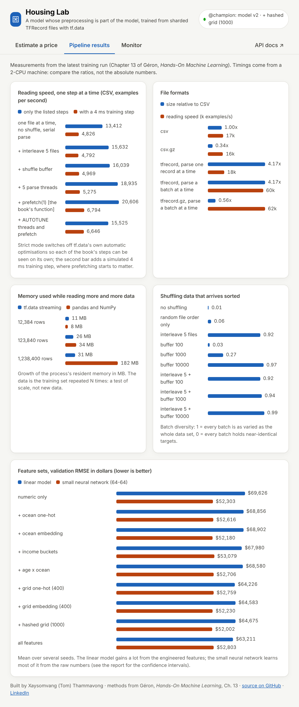
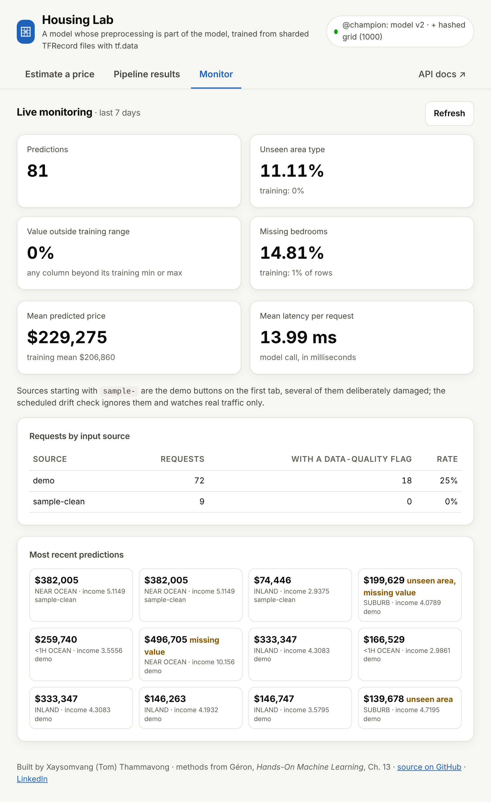

# Scalable Data Loading and Preprocessing with tf.data and TFRecord

[](https://github.com/ToMooGo/scalable-data-loading-tfdata/actions/workflows/ci.yml)


An input-pipeline benchmark that reports what it measured, negative results included, and a
train, evaluate, deploy and monitor system around it. Sharded CSV files, GZIP-compressed TFRecord
files and TensorFlow Datasets are read with `tf.data`; each result is measured in one stated run
and, where possible, checked against pandas, a formula or a baseline. The resulting Keras model,
with its preprocessing inside, is registered, checked by quality gates, served by an API and
monitored, from one configuration file and one command. The methods are those of Chapter 13 of
Géron's *Hands-On Machine Learning* (2nd edition).

**Stack:** TensorFlow 2.20, tf.data, TFRecord, Keras 3, Prefect, MLflow, FastAPI, PostgreSQL, Docker Compose, GitHub Actions, pytest, ruff

**[Technical report (PDF)](reports/technical_report/technical_report.pdf)**: all tables, figures and derivations.

The data are the California housing data of Chapter 2 of the same book. They are small (20,640
rows); the project does not claim that streaming is needed for them. It builds the pipeline that
scales and measures how it behaves, including when the training set is repeated 100 times.

## Key findings

Negative results first. All numbers come from one run of `make train` ([RESULTS.md](reports/RESULTS.md), [tables](reports/tables)).

1. **In memory beats streaming on data this small.** A pandas and NumPy baseline reads about 355,000 examples per second; the CSV pipelines reach at most about 26,000 and the TFRecord pipeline 62,195.
2. **TFRecord does not save space.** It is 4.17 times the size of the CSV, and with GZIP (483,662 bytes) it is still larger than the gzipped CSV (287,248 bytes).
3. **`AUTOTUNE` was slower than the book's constants** on this two-core machine: 15,525 against 20,606 examples per second (only the listed steps, no training step).
4. **Batch-wise parsing is what makes TFRecord fast:** 60,155 examples per second against 17,964 when parsing one record at a time (3.3 times). The comparison does not separate the file format from the batching.
5. **The 400-cell location grid helps the linear model clearly** (validation RMSE 6.7 % lower); **the small network gains little**: no feature set is shown to beat the raw numbers.
6. **Deployed model: test RMSE $50,751, 95 % interval $48,690 to $52,732** (the t-interval of Chapter 2, which covers only the sampling variation of the 4,128 test rows), 24.7 % below the linear model of Chapter 2.

## What it demonstrates

Each claim maps to the code and to one measured result; the details are in `reports/RESULTS.md` and the report.

| Claim | Code | Evidence from the run |
|---|---|---|
| `tf.data` pipeline over sharded CSV files: 5 interleaved files (the book's `n_readers=5`), shuffle, parse, standardise, batch, prefetch | `csv_pipeline.py`, `part_a_csv.py` | With only the listed steps, the book's steps take the speed from 13,412 to 20,606 examples per second (1.54 times); with the `tf.data` defaults the plain pipeline is already as fast. |
| Shuffling of data that arrives sorted | `benchmark.py`, `part_a_csv.py` | Rank correlation of position and target: 1.000 unshuffled, 0.005 with 5 interleaved files; a 1,000-row buffer alone leaves 0.965 (formula: 0.963). |
| GZIP-compressed TFRecord files of `tf.train.Example` (Protocol Buffers) | `tfrecord.py`, `part_b_tfrecord.py` | A formula predicts the size of all 12,384 records exactly. In the committed run all 4 damaged files tested stop with a `DataLossError` (for GZIP files the test does not show whether the checksums or the decompression raised it). A truncated GZIP file can occasionally end cleanly with fewer records, so the record count must be checked as well. |
| Features API: one-hot of a 5-category variable, a 20 x 20 (400-cell) crossed grid, embeddings; Keras 3 layers replace the deprecated `tf.feature_column` | `features.py`, `part_c_features.py` | 9 feature sets x 2 models x 5 seeds with paired intervals; the request path and the training path give identical predictions (largest difference 0 dollars). |
| TensorFlow Datasets as benchmark data: `tfds.load("mnist")`, through a checksum-verified mirror when the Google Cloud Storage address cannot be reached | `mnist_tfds.py`, `part_d_tfds.py` | The same classifier reaches 0.9757 test accuracy from `tfds.load` and 0.9764 from TFRecord files (3 seeds; the paired interval of the difference contains 0). |
| A trained model that is checked, served and monitored | `flows/`, `gates.py`, `services/api/`, `monitoring.py` | Train, evaluate and deploy flows (Prefect, MLflow); 8 quality-gate checks; champion and challenger; a canary request after every deployment; reload without a restart, with rollback; drift monitoring. |

## Results at a glance

Timings are medians of several passes on a two-core machine; compare ratios, not absolute numbers.

| Question | Result |
|---|---|
| How large is a TFRecord file next to the CSV? | 3,576,363 bytes against 856,778 (4.17 times). With GZIP, 483,662 bytes (0.56 times). A GZIP-compressed CSV is smaller still: 287,248 bytes (0.34 times). |
| What does a TFRecord buy? | Speed, through batch-wise parsing, which this comparison cannot separate from the file format (report, section 5.3): 62,195 examples per second from the compressed files, against 16,602 for the CSV pipeline. It does not buy size. |
| How do memory and speed grow with the data? | At 100 times the training set (1,238,400 rows) the memory of the `tf.data` pipeline grows by 31 MB and that of pandas by 182 MB; the pipeline reads 60,000 to 65,000 examples per second at every size. Pandas is faster in time on these data. |
| Which features help? | For the linear model, the 400-cell location grid lowers the validation RMSE from $68,856 to $64,226 (6.7 %). The small neural network is already much better with the raw numbers (validation RMSE about $52,600). For it, no feature set is shown to beat the raw numbers once the number of intervals is taken into account: the numeric-only network (4,801 parameters) is within about $300 of the deployed set, which was chosen by the stated rule (lowest mean validation RMSE), so its small lead is not a finding. |
| Which model is deployed? | The small network with the hashed grid, chosen on the validation data: test RMSE $50,751 with a 95 % interval of $48,690 to $52,732 (the t-interval of Chapter 2; it covers only the sampling variation of the 4,128 test rows), R² 0.802. The linear model of Chapter 2 gives $67,368 and always predicting the mean $114,164, so the deployed model is 24.7 % and 55.5 % better. |

Everything in this section comes from `reports/RESULTS.md` and `reports/tables/*.csv`, which one run of
`make train` writes; the interval of the test RMSE is computed from `reports/tables/test_predictions.csv`
when the report is built. The full set of tables, all figures and the mathematics behind them are in the
[technical report](reports/technical_report/technical_report.pdf).

## Pipelines and architecture



*The CSV pipeline (left) and the TFRecord pipeline (right). The orange outlines mark the two steps that swap places between the lanes: the CSV lane parses each line before batching, the TFRecord lane batches first and parses the whole batch in one call.*



*Arrows point from the caller to the component it uses; the arrows between the three flows show the order in which they run. Blue: pipeline flows and MLflow; orange: the service; green: monitoring; grey: data and other components.*

## Quick start

You need Python 3.12 or newer. Docker is optional.

```bash
git clone https://github.com/ToMooGo/scalable-data-loading-tfdata.git
cd scalable-data-loading-tfdata
make install    # pinned dependencies (TensorFlow 2.20, Keras 3.15, ...) and the package
make test       # offline unit and API tests
make quick      # train, evaluate and deploy with the quick configuration (about 5 minutes; writes reports/quick/)
make api        # web page and API on http://localhost:8000
```

`make train` runs the full experiment that produced the numbers above (about 45 minutes on two CPU cores)
and rewrites `reports/`; `make quick` writes to `reports/quick/` and leaves the committed results alone, so the
"Pipeline results" page keeps showing the full run (start `make api` with `REPORTS_DIR=$PWD/reports/quick` to
see the quick run instead). `make report` turns the result tables into LaTeX and builds the PDF.

With Docker, `make up` starts PostgreSQL, MLflow, Prefect and the API and then runs the pipeline in a
container; the web page is on http://localhost:8000, MLflow on http://localhost:5050 and Prefect on
http://localhost:4200. `FLOW_CONFIG=configs/quick_flow_config.yaml make up` does the same with the
quick configuration.

## The web page

The service serves a small web page on the same port as the API. It estimates a price from the raw columns of a census block, shows what the preprocessing layers made of the request, displays the measurements of the training run, and shows the monitoring of the logged requests. Click a picture for the full size.

<table>
<tr>
<td align="center" valign="top"><a href="docs/images/ui_estimate.png"></a></td>
<td align="center" valign="top"><a href="docs/images/ui_pipeline.png"></a></td>
<td align="center" valign="top"><a href="docs/images/ui_monitor.png"></a></td>
</tr>
<tr>
<td align="center">Estimate page</td>
<td align="center">Pipeline results page</td>
<td align="center">Monitor page: demo traffic with deliberately damaged inputs</td>
</tr>
</table>

## How the code follows the book, and where it differs

| Book (Chapter 13) | Code |
|---|---|
| `csv_reader_dataset`: list files, interleave, shuffle, map, batch, prefetch | `src/tfdata_mlops/csv_pipeline.py` |
| `tf.train.Example`, `TFRecordWriter`, `TFRecordDataset`, GZIP, `parse_example` | `src/tfdata_mlops/tfrecord.py` |
| `tf.feature_column`: bucketised, vocabulary, indicator, crossed, embedding | `src/tfdata_mlops/features.py` (Keras 3 layers) |
| `tfds.load("mnist", batch_size=32, as_supervised=True)` | `src/tfdata_mlops/mnist_tfds.py` |

The differences are deliberate and written down in [docs/DESIGN.md](docs/DESIGN.md):

- **Keras 3 layers instead of `tf.feature_column`.** TensorFlow has deprecated the old API and Keras 3 removed `DenseFeatures`. The boundaries, vocabulary, 20 × 20 grid and hash sizes are the book's numbers.
- **Housing data only.** The CSV and TFRecord parts use the one data set of Chapter 2, verified against pinned SHA-256 digests.
- **MNIST through a checked mirror when needed.** If the Google Cloud Storage address that TFDS uses cannot be reached, the four official files are fetched from a public mirror, checked against the official MD5 sums and given to TFDS's own builder. The route used is recorded with every run.
- **Two timing regimes.** Current TensorFlow rewrites a pipeline with its own optimisations; the benchmark therefore reports *only the listed steps* and *tf.data defaults* separately.
- **Readers and reading threads.** As in the book, five files are open at the same time and their lines are interleaved (`n_readers=5`). The number of reading threads is a separate argument, `n_read_threads`: it is `None` in the book's function and in variants 2 to 5 of the benchmark, and `AUTOTUNE` in variant 6 and in the pipelines that train the models.

The MLOps system around the book's content (Prefect, MLflow, FastAPI, PostgreSQL, Docker Compose,
quality gates, drift monitoring, CI) is not in the book. Its structure follows the public example
repository [full-stack-on-prem-cv-mlops](https://github.com/jomariya23156/full-stack-on-prem-cv-mlops).

## Repository layout

The experiment has five parts: **A**, the CSV pipeline; **B**, TFRecord; **C**, the features;
**D**, TensorFlow Datasets and MNIST; **E**, the deployed model.

```text
configs/         one YAML file per flow (full, quick, monitor)
flows/           Prefect flows: train, evaluate, deploy, monitor
src/tfdata_mlops/
                 the package: csv_pipeline, tfrecord, features, benchmark, part_a ... part_e,
                 gates, monitoring, tracking, plots
services/        Dockerfiles and requirements: api (FastAPI + web page), mlflow, pipeline, postgres
tests/           unit, API and integration tests
reports/         tables, figures, RESULTS.md, metrics.json, technical_report/ (LaTeX and PDF)
docs/            DESIGN.md, the two diagrams and the scripts that draw them
notebooks/       a guided tour of the pipelines
.github/         CI workflow and Dependabot
```

## Tests and continuous integration

`make test` runs 138 offline tests: the pipeline against pandas, the exact TFRecord size
formula, damaged-file detection, a dense layer against an embedding, the quality gates, the drift
checks, the deploy flow (canary request, rollback of the registry and of the API) and the API
(validation, reload, rollback). `make test-all` adds an integration test that runs
the Prefect flows with MLflow on the quick configuration. The GitHub Actions workflow runs ruff and
the tests on Python 3.12 and 3.13, then builds the Docker images, starts the stack, runs the quick
configuration in the container and sends a request to the API.

## Limits

- All timings are from a two-core cloud machine. Compare ratios, not absolute numbers: within one run, the same CSV pipeline timed in two experiments gave 15,104 and 16,602 examples per second, about 10 % apart. The tables of only one complete run are stored.
- On 20,640 rows a pandas and NumPy baseline that loads the CSV shards into memory beats every streaming pipeline (about 355,000 examples per second against at most about 26,000 for the CSV pipelines and 62,195 for TFRecord), and the report shows it. The scale test repeats the training set; no model is trained on the repetitions.
- Only 133 of the 400 grid cells hold training rows, and hashing the 400 cells into 1,000 buckets (the book's choice) makes 6 occupied cells share a bucket. The linear model is $449 worse with the hashed grid than with the exact one-hot grid.
- TFRecord is not smaller than a GZIP-compressed CSV for these data (see the results).
- The median house value is capped in the data (Chapter 2 of the book). The 179 test rows at the largest value, $500,001, have an RMSE of $92,718, against $47,987 for the other rows.
- The quality-gate thresholds are choices of this project, meant to catch a broken model.
- The quality gates and the comparison with the champion use the test set. The model and the feature set were chosen on validation data only, but the gate thresholds were set after a first run, so the test numbers are a final report, not a fresh, untouched estimate for every decision made after looking at them.

## Author

Xaysomvang (Tom) Thammavong · [GitHub](https://github.com/ToMooGo) · [LinkedIn](https://www.linkedin.com/in/xaysomvang-thammavong-63189a1b9/) · tom.physics.unideb@gmail.com · MIT license.
